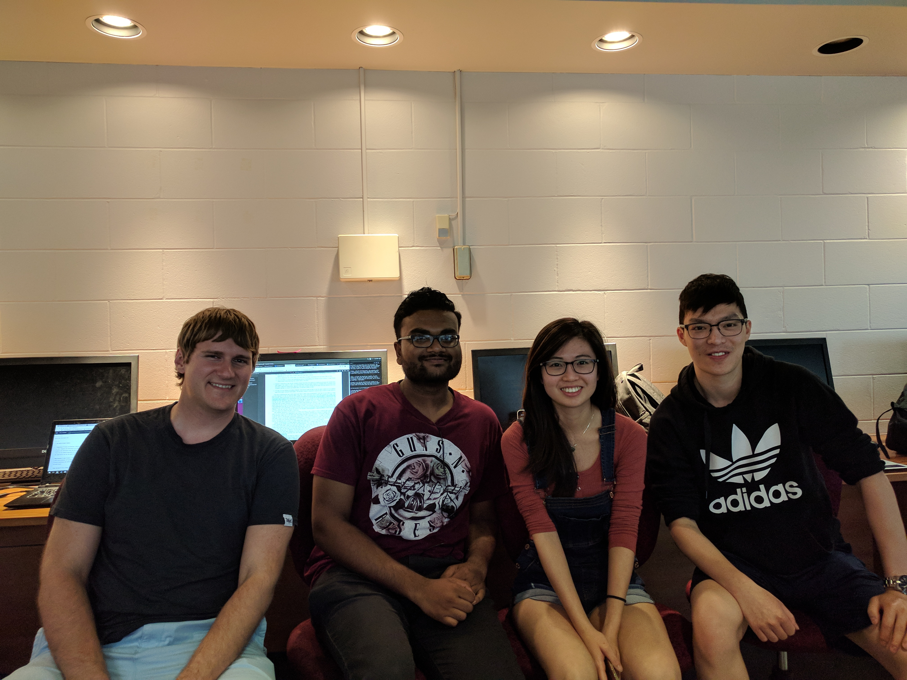

## CSC C01 Process

Our team met twice in person to complete the first phase of the project. 
The first meeting was a brief planning meeting where we discussed our 
interpretations and plans for the assignment. This meeting allowed us to 
better align our objectives and goals as a team. To conclude our 
meeting, each team member was assigned a specific section of the project 
to look into for our next meeting.

Our second meeting, was a work meeting of three hours. We began the 
meeting by discussing our thoughts, process and obstacles with our 
respective parts. After which, we went through as a group to write and 
discuss each section. All disagreements were settled on a majority vote 
basis.

Our workflow was organized using Google Docs and Slack. Slack was used 
as a primary communication channel for offline discussions. Google Docs 
was used to collaboratively write and view written notes and progress 
for phase 1 files. For the user interface, we used JustInMinds 
prototyper, a program available on the BV lab machines.

Team decisions were made on a majority vote basis (requiring 3 of 4 
members). Specifically to user stories, the stories were ranked using a 
variation of planning/scrum poker where each member ranked difficulty 
and priority on a easy/medium/hard scale. For discrepancies, members 
explained reasoning and voted again until consensus was reached.

Our key takeaways from phase 1 mainly centered around the design of the 
file management system. As a team, we felt it was important to index 
more than simply the suggested file extension. In our design, we also 
plan to index and track the file type (exams, lecture notes, projects, 
etc) and file visibility (student, instructor, both). These tags will be 
important for user actions outside of just searching and querying files. 
For example, if users want to delete files we agreed this action would 
be dependent on file type. Where users had the option to upload and 
delete common notes freely but exam files would require review from 
instructors. Additionally, we discussed whether files shared across 
accounts would be encoded with a hard or soft link and how we would 
manage potential file changes and disruptions.

